> [!warning] This is meant to be previewed from inside Obsidian

## 1. Introduction

"Chew the Cud" is a comprehensive Obsidian vault template designed to streamline personal knowledge management and task organization. This template provides an opinionated setup that combines various plugins, templates, configurations, CSS snippets, and user scripts to create a ready-to-use system that is heavily relies on Obsidian's Reading view and QuickAdd and Forms for quickly creating new notes.

> [!focus] This template aims to provide a robust starting point for Obsidian users, whether you're new to Personal Knowledge Management or looking to enhance your existing setup. While it offers a specific workflow, all components can be customized to suit your individual needs.

The name "Chew the Cud" reflects the system's core philosophy: just as ruminants regurgitate and re-chew their food to extract maximum nutrition, this system encourages revisiting and refining ideas to gain deeper understanding and generate new insights.

The README will guide you through:

1. Setting up the vault
2. Understanding the folder structure
3. Using the provided templates and scripts
4. Customizing the system to your preferences

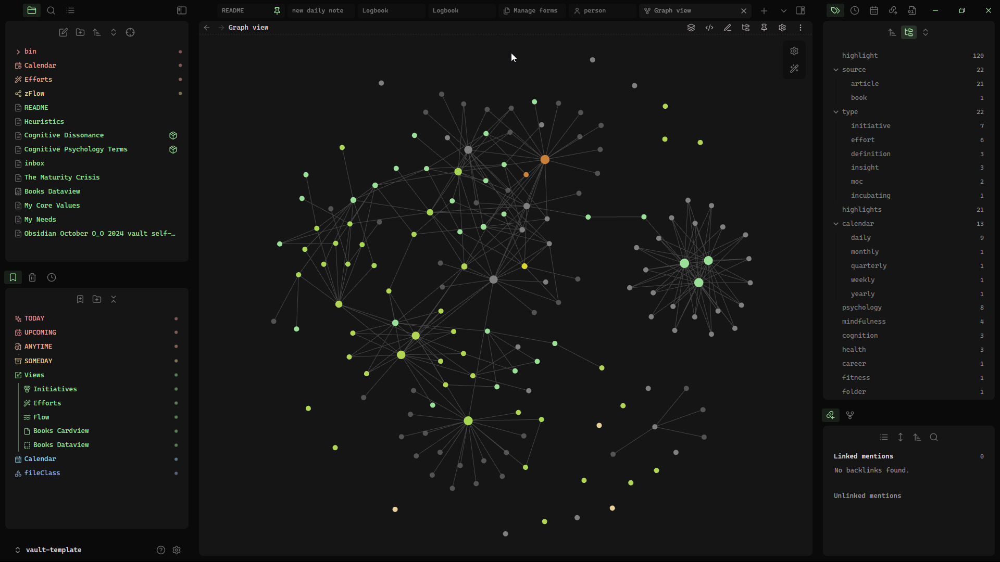

See **Resources** for understanding the foundations on which this system is based on.

## 2. Getting Started

### Initial Setup

1. Download the vault template:
   - Option A: Download ZIP from [GitHub - zubayrali/vault-template](https://github.com/zubayrali/vault-template)
   - Option B: Clone the repository
2. If you downloaded the ZIP, unzip it to your desired location
3. Open Obsidian
4. In the startup screen, select "Open folder as vault"
5. Navigate to and select the unzipped folder (or cloned repository)

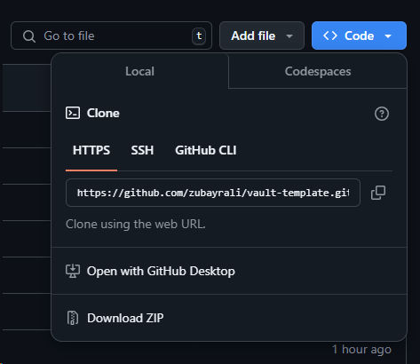

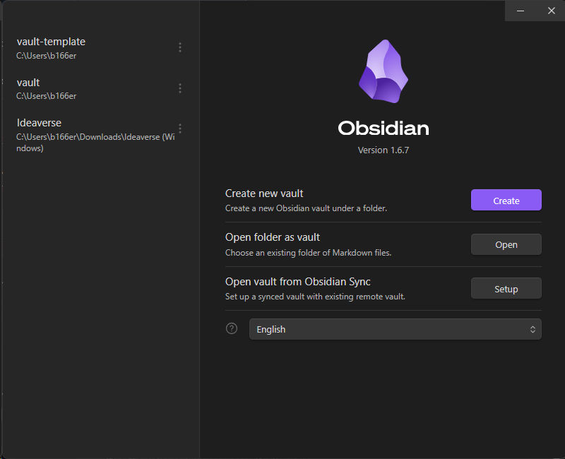

### Next Steps

After setting up your vault:

1. Familiarize yourself with the folder structure
2. Review the pre-configured templates
3. Customize your daily note template if needed
4. Explore the pre-set workspaces Use `Alt + Z` or `Alt + S` to load or manage workspaces. The default workspace is "Daily Note"

## 3. Folder Structure

```
├── .obsidian # Obsidian configuration files (hidden in file explorer by default)
├── .git # files related to your git repository (hidden in file explorer by default)
|
├── Calendar/  # Periodic Notes
│   ├── 2024/  # Year-specific folder
│   │   ├── Daily/  # Daily notes
│   │   ├── Weekly/  # Weekly reviews
│   │   ├── Monthly/  # Monthly plans and reviews
│   │   ├── Quarterly/  # Quarterly assessments
│   │   └── Yearly/  # Annual reviews and planning
│   └── Tasks/  # Task management and Taskido 
│
├── Efforts/  # Projects and areas of focus
│   ├── Initiatives/  # Specific project folders
│   └── [Various effort folders]  # Individual effort tracking
│
├── zFlow/  # Core of the Zettelkasten-style system
│   ├── Canvas/  # Visual note-taking and mind mapping
│   ├── Drawings/  # Sketches and visual aids
│   ├── Eggs/  # Initial ideas or fleeting notes
│   ├── Incubating/  # Developing ideas and literature notes
│   ├── Insights/  # Well-developed, permanent notes
│   ├── MOCs/  # Maps of Content
│   └── Sources/  # Reference materials
│       ├── Articles/
│       ├── Books/
│       ├── Misc/
│       ├── Papers/
│       ├── Poems/
│       ├── Quotes/
│       └── Videos/
│
├── bin/  # System files and resources
│   ├── assets/  # Images and media files
│   ├── classes/  # fileClass definitions for Metadata Menu
│   ├── patterns/  # Mesh-AI plugin related
│   ├── scripts/  # User functions, scripts used by QuickAdd and Templater
│   ├── templates/  # Templater templates and other reference templates
│   └── views/  # Custom view configurations, Taskido
|
│── index.md
└── README.md # 🟢 YOU ARE HERE
```

## 4. Note Types

### Source Note

Open Open note: [[Don't Believe Everything You Think]]

```markdown
---
fileClass: book
id: 20241019120051
title: "Don't Believe Everything You Think"
author: "[[Joseph Nguyen]]"
# README
---

… (rest of the note)
```

### Fleeting Note (In Daily Note)

Let's say you're reading [[Sylvia Plath]]'s journal and it reminds you of a concept from "[[Don't Believe Everything You Think]]". You quickly jot this down in your daily note [[2024-10-20]] :

```markdown
---
fileClass: calendar, daily
title: "2024-10-20"
# … (other metadata)
---

## Daily Log

- 10:01 
  - Reading Plath's journals - her intense self-doubt reminds me of the concept in [[Don't Believe Everything You Think]] about not getting caught in negative thought loops. Wonder how her writing might have changed if she had access to these modern psychological insights?  
```

This fleeting note captures a momentary thought connection. It may or may not lead to further exploration.

### Literature Note (Incubating)

While reading "[[Don't Believe Everything You Think]]", you decide to create a literature note to capture and process some key ideas:

Here's how it would look:

1. Create a new file:
   - Press `Ctrl + N` to open a new file.
   - Name the file as "[[Overcoming Negative Thought Loops]]".
2. Insert the Note Template:
   - Press `Ctrl + Enter` to insert the [[Note Templater]] template, which will trigger the modal form **Note**.

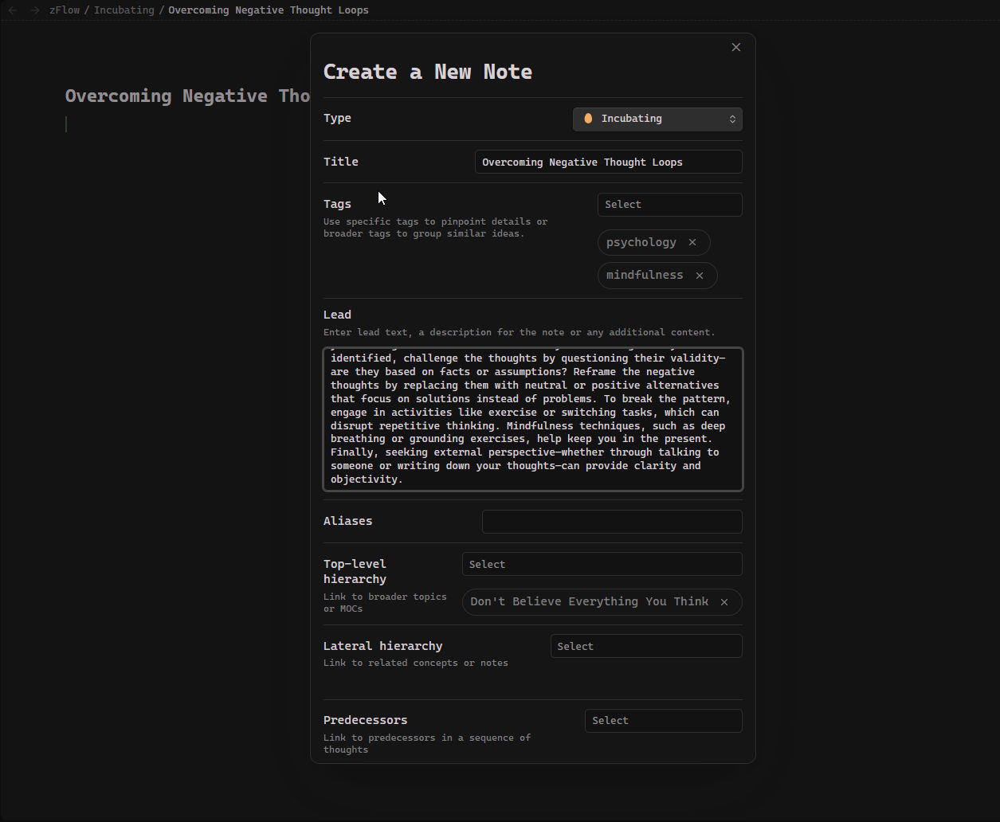


```markdown
---
title: Overcoming Negative Thought Loops
fileClass: incubating
lead: To overcome negative thought loops, start by recognizing when you're caught in one. Awareness is key to breaking the cycle. Once identified, challenge the thoughts by questioning their validity—are they based on facts or assumptions? Reframe the negative thoughts by replacing them with neutral or positive alternatives that focus on solutions instead of problems. To break the pattern, engage in activities like exercise or switching tasks, which can disrupt repetitive thinking. Mindfulness techniques, such as deep breathing or grounding exercises, help keep you in the present. Finally, seeking external perspective—whether through talking to someone or writing down your thoughts—can provide clarity and objectivity.
tags:
  - type/incubating
  - psychology
  - mindfulness
up:
  - "[[Don't Believe Everything You Think]]"
---

# Overcoming Negative Thought Loops

`VIEW[{lead}][text]`

## Key Concepts:

1. Root cause of psychological suffering
2. Breaking free from negative thought patterns
3. Creating a new experience of life

## Thoughts:

- Nguyen's approach seems to align with mindfulness practices
- Interesting parallel with cognitive behavioral therapy techniques
- How does this compare to other self-help approaches?

## Questions to Explore:

- What are the practical steps to implement these ideas in daily life?
- How does this approach handle clinical depression or anxiety?
- Are there any potential downsides to constantly questioning our thoughts?

## Connections:

- Reminds me of [[Sylvia Plath]]'s struggles with negative self-talk
- Similar themes in [[The Power of Now]] by Eckhart Tolle

## Potential Applications:

- Personal journaling practice
- Developing a meditation routine focused on thought observation
```

### Permanent Note (Insight)

After reflecting on the ideas from the book and your literature note, you decide to create a more developed insight [[The Observer Self]]:

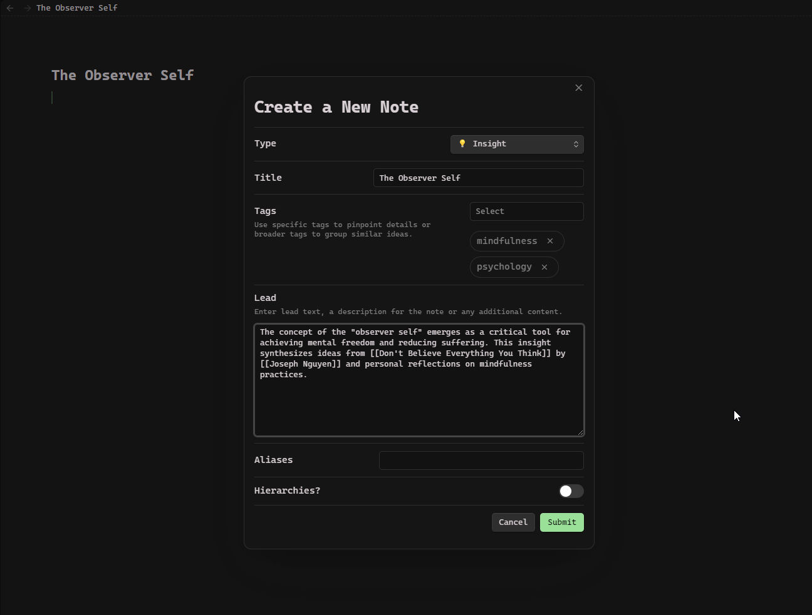


```markdown
---
title: The Observer Self
fileClass: insight
lead: The concept of the "observer self" emerges as a critical tool for achieving mental freedom and reducing suffering. This insight synthesizes ideas from [[Don't Believe Everything You Think]] by [[Joseph Nguyen]] and personal reflections on mindfulness practices.
tags: 
  - type/insight
  - mindfulness
  - psychology 
---

# The Observer Self

`VIEW[{lead}][text]`

Key points:
1. Separation of Self from Thoughts: By cultivating an "observer self", we create distance between our core identity and our thoughts.
2. Reduced Emotional Reactivity: This distance allows us to respond to thoughts rather than automatically react to them.
3. Breaking Negative Cycles: Observing thoughts without judgment can interrupt habitual negative thought patterns.
4. Enhanced Self-Awareness: Regular practice of observing thoughts leads to greater understanding of one's mental patterns.

Practical applications:
- Mindfulness meditation focusing on observing thoughts
- Journaling exercises to externalize and examine thoughts
- Cognitive restructuring techniques in therapy

Questions for further exploration:
- How does the concept of the observer self relate to different cultural and philosophical traditions?
- Can over-reliance on the observer self lead to emotional detachment?

This insight connects ideas from [[Overcoming Negative Thought Loops]] with broader concepts of mindfulness and cognitive psychology. It also provides a framework for understanding the struggles of individuals like [[Sylvia Plath]], highlighting how this modern understanding might have impacted historical figures dealing with mental health challenges.
```

### Map of Content (MOC)

As you continue to explore these ideas, you might create or update a Map of Content [[Cognitive Psychology MOC]]:

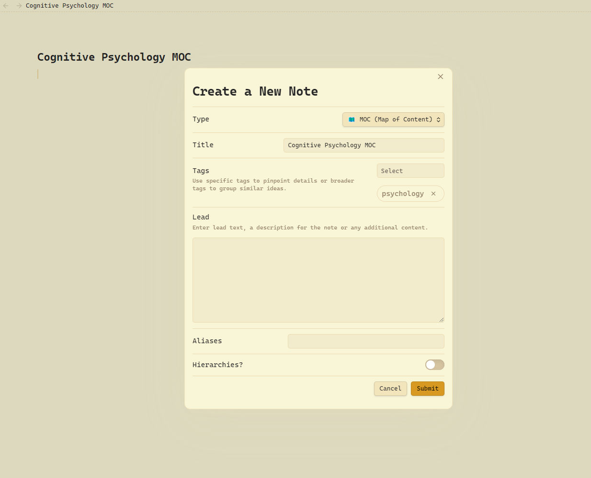

```markdown
---
title: "Cognitive Psychology MOC"
tags:
  - type/moc
  - psychology
  - mindfulness
  - mental-health
related: "[[Cognitive Psychology Terms]]"
---

# Cognitive Psychology MOC
## Core Concepts
- [[Cognitive Biases]]
- [[Thought Patterns]]
- [[Self-Awareness]]
- [[Mindfulness]]

## Key Works
- [[Don't Believe Everything You Think]]
- [[Thinking, Fast and Slow]]

## Therapeutic Approaches
- [[Cognitive Behavioral Therapy]]
- [[Mindfulness-Based Stress Reduction]]

## Practical Applications
- [[Meditation Practices]]
- [[Daily Thought Tracking]]

## Related Insights
- [[The Role of Self-Awareness in Cognitive Restructuring]]

## Questions to Explore
- How do cognitive biases evolve over a lifetime?
- Can AI assist in identifying personal thought patterns?

## Related MOCs
- [[Mental Health MOC]]
- [[Neuroscience MOC]]
```


This example demonstrates how notes can evolve organically:
1. You start with a source (the book).
2. A fleeting thought connects it to something else you're reading (Plath's journals).
3. You create a literature note to process the book's ideas.
4. This leads to a more developed insight.
5. Finally, you organize these ideas in a Map of Content.

The process isn't linear, and not every fleeting thought leads to deeper exploration. It shows how your system can capture both quick ideas and developed insights, all interconnected through your personal knowledge web.

### Definition Notes

**Consolidated Definition File**: [[Cognitive Psychology Terms]]

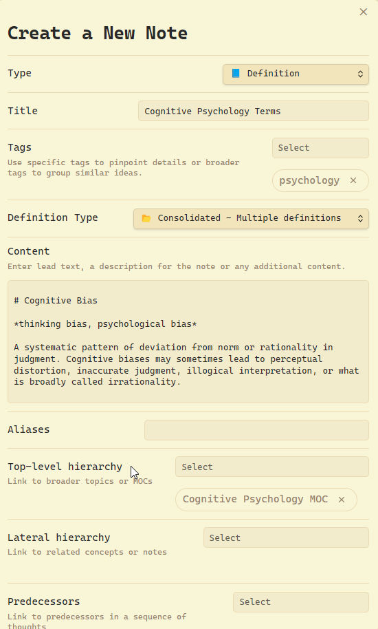


```markdown
---
title: Cognitive Psychology Terms
fileClass: definition
created: 2024-10-20T00:00:00.000-04:00
updated: 2024-10-20T12:07:30.335-04:00
aliases: 
tags: 
  - type/definition
  - psychology 
def-type:  consolidated
up: 
  - "[[Cognitive Psychology MOC]]"
related: 
prev: 
down: 
---

# Cognitive Psychology Terms

# Cognitive Bias

*thinking bias, psychological bias*

A systematic pattern of deviation from norm or rationality in judgment. Cognitive biases may sometimes lead to perceptual distortion, inaccurate judgment, illogical interpretation, or what is broadly called irrationality.

---

# Mindfulness

*present-moment awareness, mindful attention*

The psychological process of purposely bringing one's attention to experiences occurring in the present moment without judgment, which one develops through the practice of meditation and through other training.

---

# Self-Awareness

*self-knowledge, introspection*

The capacity for introspection and the ability to recognize oneself as an individual separate from the environment and other individuals. It is not to be confused with consciousness in the sense of qualia.
```

**Atomic Definition File**: [[Cognitive Dissonance]]

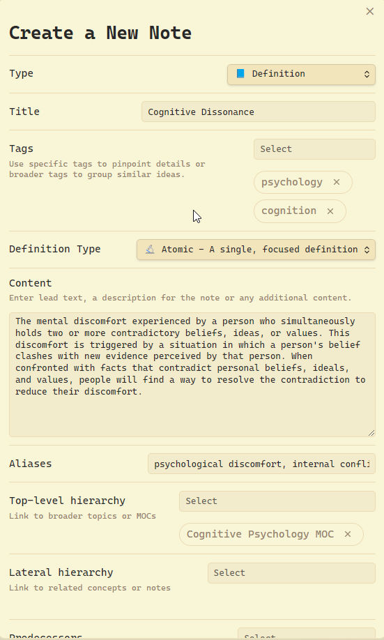

```markdown
---
title: Cognitive Dissonance
fileClass: definition
created: 2024-10-20
updated: 2024-10-20
aliases: 
  - psychological discomfort
  - internal conflict
tags: 
  - type/definition
  - psychology
  - cognition 
def-type: atomic 
up: 
  - "[[Cognitive Psychology MOC]]"
related: 
prev: 
down: 
---

# Cognitive Dissonance

 The mental discomfort experienced by a person who simultaneously holds two or more contradictory beliefs, ideas, or values. This discomfort is triggered by a situation in which a person's belief clashes with new evidence perceived by that person. When confronted with facts that contradict personal beliefs, ideals, and values, people will find a way to resolve the contradiction to reduce their discomfort.
```

### Effort (Long-term Project or Area of Focus)

[[Developing Mindfulness Practice]]

**Create the Effort**: Trigger QuickAdd Macro for creating an Effort using `Alt + D`. Select "Effort," which will create the note in the correct directory with a dedicated folder. If the template gets overwritten by other plugins, press `Ctrl + Z` right after form submission to restore the original template.

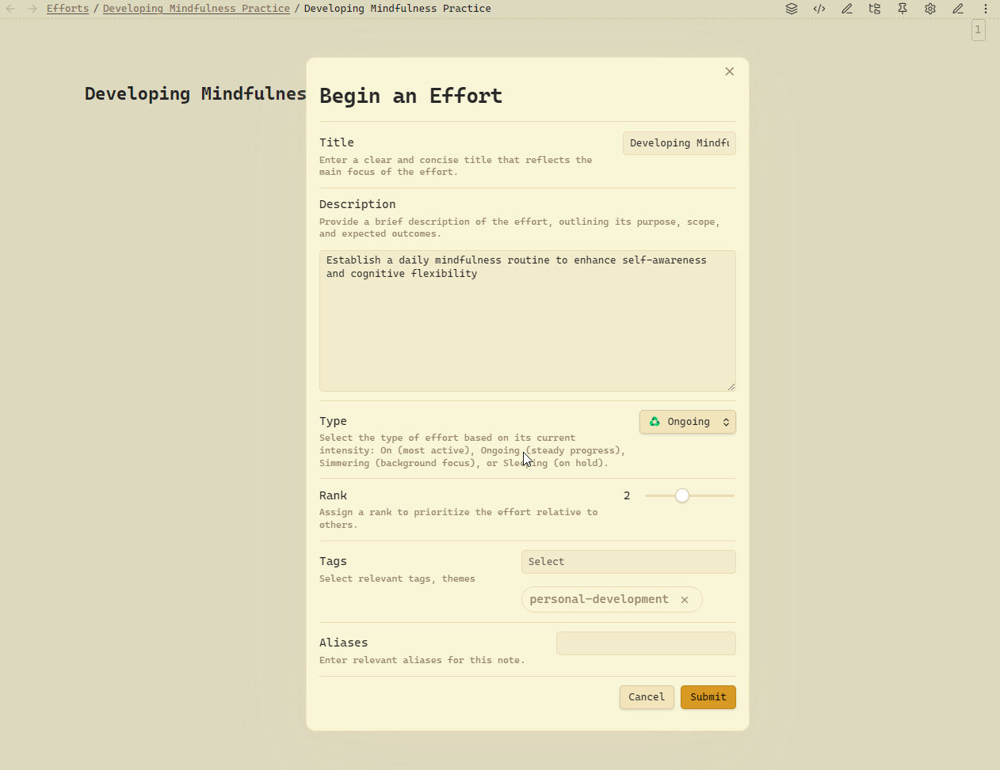

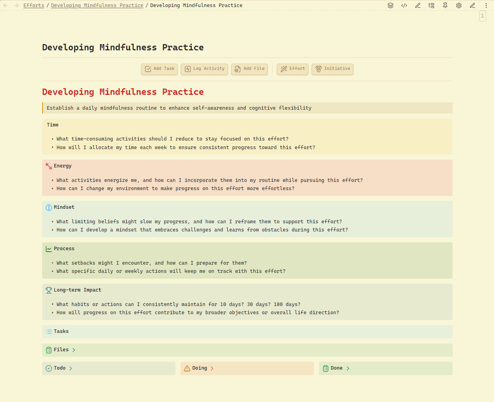

**Adding Tasks to the Effort**: Once the Effort note is created, add specific tasks related to mindfulness practice. You can add tasks manually or use natural language dates to set them.

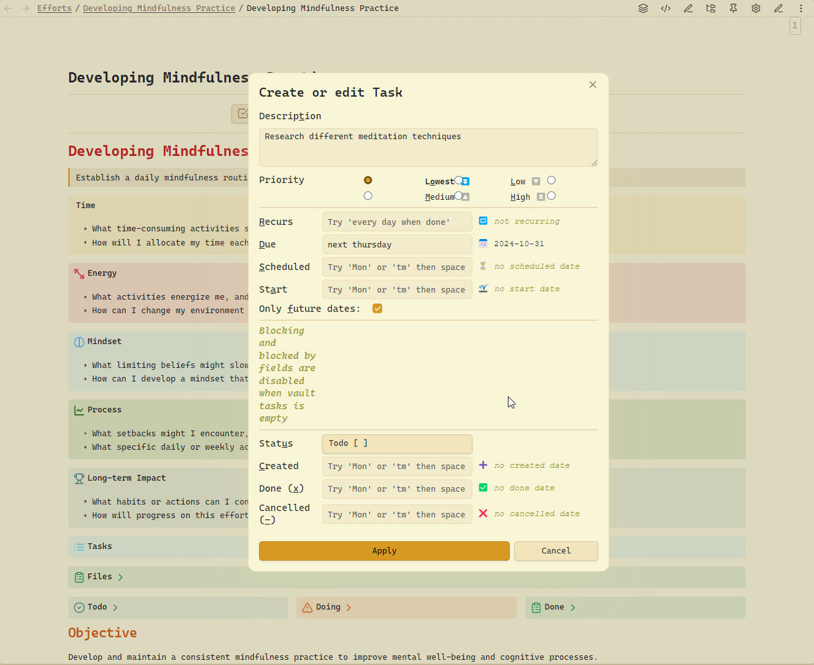

- [GitHub - argenos/nldates-obsidian: Work with dates in natural language in Obsidian](https://github.com/argenos/nldates-obsidian)

**Adding Recurring Tasks**: For practices like daily meditation, create recurring tasks to maintain consistency.

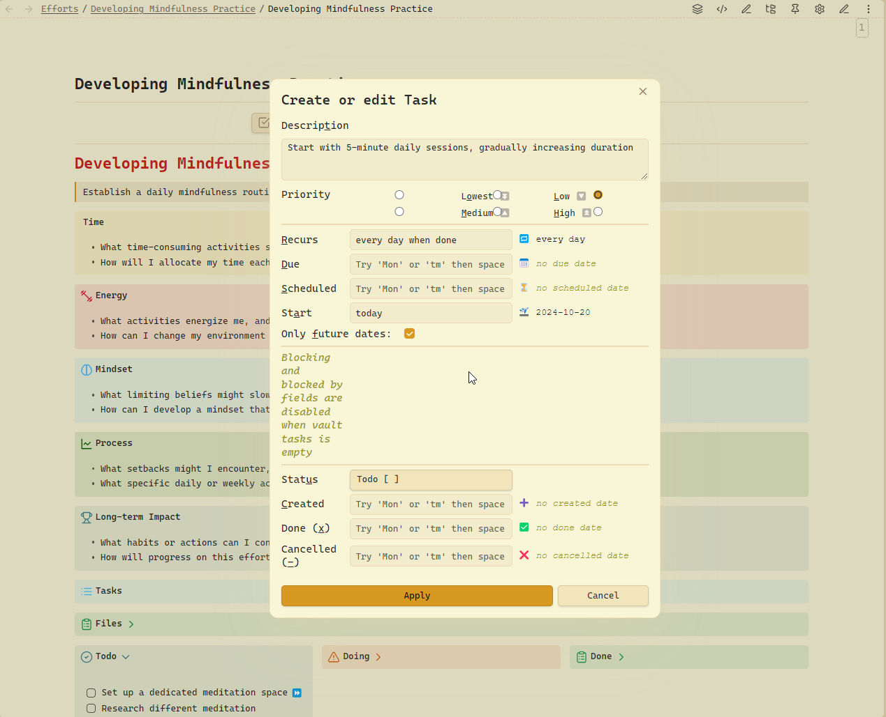

**Final Effort Note**: After populating the note with tasks and recurring tasks, ensure connections are made with other relevant notes (like insights and related readings).

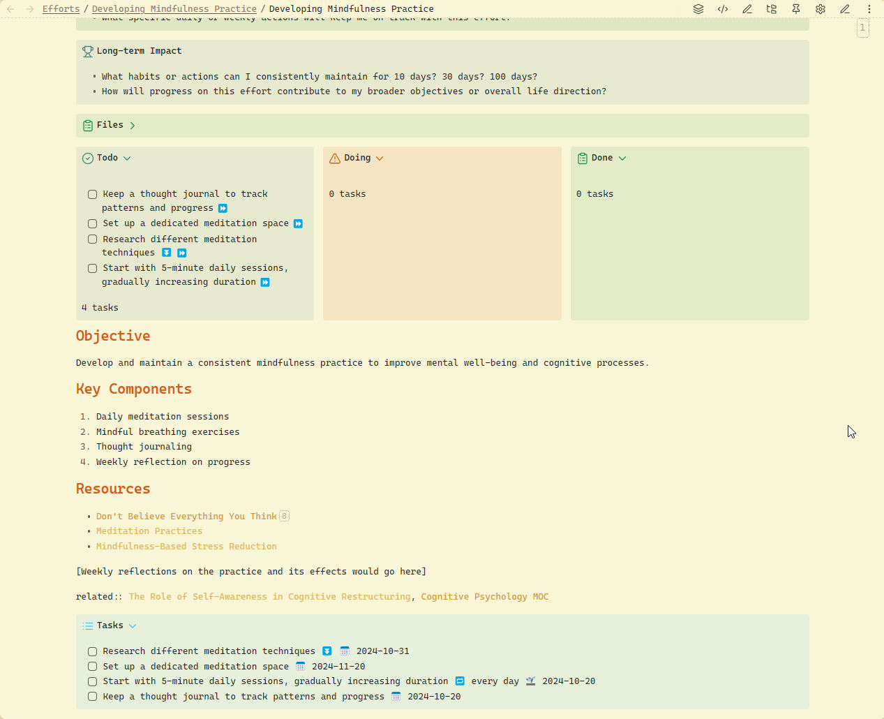

### Initiative (Project with a deadline)

The best way to learn is to teach, so let's turn this Effort into a project! The initiative will be a series based on [[Mindfulness MOC]]

**Define the Project**: Create a series of mindfulness-focused sessions or resources as part of the initiative.

**Set a Timeline**: This is a focused project with a clear goal, so choose a deadline that allows enough time for deep learning, without extending too long. Estimate a reasonable completion time based on your goal and commitment level.

[[Mindfulness Workshop Series]].

## 5. Periodic Notes

- **Daily Notes**: Core of daily capture and reflection
- **Weekly Notes**: Weekly planning and review
- **Monthly Notes**: Monthly initiatives and patterns
- **Quarterly Notes**: Personal retreat and broader review
- **Yearly Notes**: Annual planning and life audit
- **Calendar Note**: Central hub for navigating temporal notes
- **Logbook**: Aggregated view of various logs from daily notes

### Daily Note

This serves as main homepage for everyday. Logging everything.

**Morning:**
1. Open your Daily Note (use `Alt + Shift + D` to trigger LifeOS plugin)
2. Review your daily focus and work sections
3. Check upcoming tasks in the "Recycle" callout

**Throughout the Day:**
1. Use QuickAdd macros to quickly capture:
   - Highlights
   - Achievements
   - Motivations
   - Gratitude moments
2. Log fleeting thoughts and ideas in the Daily Log section
3. Complete tasks and update their status

**Evening:**
1. Complete the Evening Review section
2. Add any final thoughts or reflections

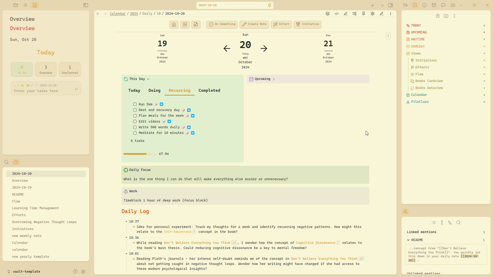

### Weekly Note

1. Open your Weekly Note
2. Review and update Weekly Initiatives
3. Complete the Wheel of Life assessment
4. Review the aggregated data from Daily Notes:
   - Highlights
   - Achievements
   - Trackers

### Monthly Note

1. Open your Monthly Note
2. Set and review Monthly Initiatives
3. Analyze Stand-Out Days from the Dataview query
4. Reflect on patterns and trends observed

### Quarterly Note

WIP

### Yearly Note

WIP

### Using the Calendar Note

The Calendar Note serves as a central hub for navigating your temporal notes:

1. Access it via [[Calendar/Calendar|<< 📆 Calendar]] link in your periodic notes
2. Use it to:
   - Navigate to specific Daily, Weekly, or Monthly notes
   - Get an overview of recent entries
   - Access your full note history

### Utilizing the Logbook

The Logbook aggregates various logs from your Daily Notes:

1. Access it via [[Logbook|📖 Logbook >>]] link in your periodic notes
2. It provides consolidated views of:
   - Gratitude Log
   - Motivation Log
   - Achievements Log
   - Daily Reviews

Use the Logbook to:
- Reflect on patterns in your thoughts and experiences
- Quickly access past insights and achievements
- Prepare for weekly and monthly reviews

### Plugins and Integrations

- **LifeOS Plugin**: Triggers Daily Note creation (`Alt + Shift + D`), this plugin helps with managing periodic notes in tandem with Journals plugin but I all so us e it for the **Usememos** integration
- **Homepage Plugin**: Configures the default workspace to open the Daily Note view
- **Journals Plugin**: Manages the structure of periodic notes
- **Templater**: Handles templating for note creation
- **QuickAdd**: Provides macros for quick capture of various log entries
- **Dataview**: Powers queries in Calendar, Logbook, and periodic notes
- Consistency is key: Try to engage with your Daily Note every day
- Use **QuickAdd macros** throughout the day for effortless capture
- Regularly review longer-term notes (Weekly, Monthly, etc.) to stay aligned with your goals
- Customize templates and queries as needed to fit your specific workflow

## 6. Flow Method

> [!summary] Note
> Remember, this system is adaptable. As you use it, feel free to adjust the structure to better fit your workflow and thinking process.

Go to [[Flow]] navigation page.


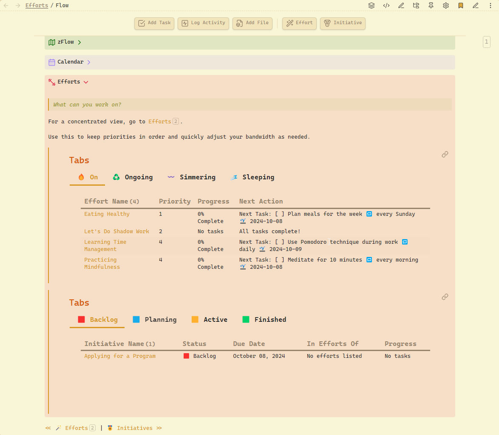

- Efforts
	- Categories (On, Ongoing, Simmering, Sleeping)
	- How to create and manage Efforts
- Initiatives
	- Statuses (Backlog, Planning, Active, Finished)
	- Creating and tracking Initiatives

## 7. Task Management

- Tasks Plugin
- Taskido (sidebar, mostly redundant IMO cuz I will be utilizing LifeOS Pro Calendar view for timeline view of my tasks)
- Tabs plugin with Dynamic Embed pugin (Today's and Upcoming in daily note)
- Recurring tasks for habits formation, recurring with a start date or scheduled tasks from efforts and initiatives
- Taskido sidebar integration
- Task creation and management workflow

## 8. Tag Taxonomy

- Explanation of tagging system
- List of primary tags and their meanings
- Best practices for tagging

## 9. Plugins

- List of essential plugins
- Configuration guide for each plugin
- How plugins integrate with the system

I am using a combination of a few plugins:

- Metadata Menu fileClasses for managing Metadata and standardization, I can either use templates to insert metadata or the metadata menu plugin.
- AutoNote Mover will move the files created to their respective directories based on the tag.
- **LifeOS Plugin** Use `Alt + Shift + D` to trigger the LifeOS plugin's Daily Note creation
- **Homepage Plugin**
  - Configured to open a workspace that displays the daily note view
  - Triggers the LifeOS: Create Daily note command when the Daily Note workspace is selected

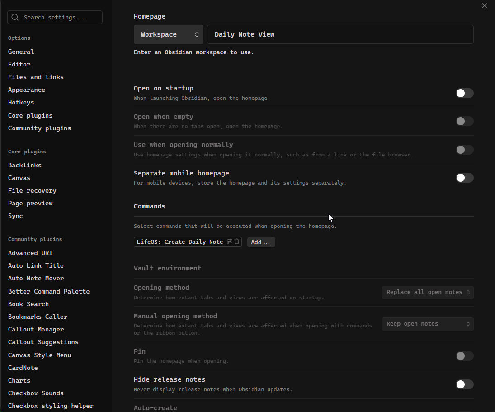

Workspaces allow you to quickly jump between different configurations of your vault:

1. [GitHub - quanru/obsidian-lifeos: Obsidian Plugin for combining P.A.R.A with Periodic Notes(LifeOS for Obsidian)](https://github.com/quanru/obsidian-lifeos)
2. [Homepage](https://github.com/mirnovov/obsidian-homepage)

## 10. Hotkeys and Shortcuts

- List of custom hotkeys
- Essential Obsidian shortcuts
- How to modify hotkeys
- `Alt + Shift + W` = LifeOs Create Weekly note
- `Alt + Shift + D` = LifeOs Create Daily note
- `Alt + Shift + M` = LifeOs Create Monthly note
- `Alt + Shift + Q` = LifeOs Create Quarterly note
- `Alt + Shift + Y` = LifeOs Create Yearly note
- `Alt + D` - QuickAdd Trigger
- `Ctrl + Enter(↩️)` - Templater Insert Template
- `Alt + Ctrl + E` - Emoji
- Workspaces - `Alt + S` manage workspaces, `Alt + Z` Load workspace
- `Ctrl + Shift + S` - to save workspace as it is currently in currrent state.
- `Ctrk + Shift + R` - Delete Current File(Move to trash)
- `Ctrl + W` - Close current tab
- `Ctrl + Shift + T` - Restore closed tabs
- `Ctrl + T` - new tab
- `Alt + B` - Add bookmark
- `Alt + Shift + B` - Focus Bookmark Sidebar
- `Alt + E` - Toggle Live preview reading
- `Ctrl + Shift + Space` - Toggle both sidebars on/off
- `Ctrl + Shift + S` - Create new book note
- `Ctrl + Shift + R` - Delete Current File
- `Alt + T` - Create or edit Task (Tasks Plugin)
- `Ctrl + ,` - Open Settings

## 11. Workflows

1. **Quick Capture**: Use 'inbox.md' or Daily Notes in Calendar for initial thoughts (Eggs/Fleeting notes).
2. **Idea Development**: Move developing ideas to 'Incubating' in zFlow.
3. **Reference Storage**: Organize references in 'Sources' subfolders using various capture methods.
4. **Knowledge Synthesis**: Create 'Insights' as you connect and develop ideas.
5. **Knowledge Navigation**: Use 'MOCs' (Maps of Content) to organize and navigate your knowledge.
6. **Project Tracking**: Manage ongoing projects and focus areas in 'Efforts'.
7. **Time Management**: Utilize 'Calendar' for daily notes, tasks, and regular reviews.
8. **System Resources**: Access templates, scripts, and configurations in the 'bin' folder.

> [!warning] Review and maintenance workflow

## 12. Integration with External Tools

- useMemos integration

## 13. Customizations

- See [[templates]] to find all the templates.
- Modifying the QuickAdd functions to change Dataview ineline metadata fields used in [[Calendar/Logbook|Logbook]] and in other places to fit personal needs.
- [style-settings](https://github.com/mgmeyers/obsidian-style-settings) for changing how the Notetoolbar appears, the theme [AnuPpuccin](https://github.com/AnubisNekhet/AnuPpuccin) by AnubisNekhet with [extended-colorschemes](https://github.com/AnubisNekhet/AnuPpuccin/blob/main/snippets/extended-colorschemes.css).
- [iconic](https://github.com/gfxholo/iconic) for customzing Icons
- [commander](https://github.com/phibr0/obsidian-commander) to add commands/buttons.
- [note-toolbar](https://github.com/chrisgurney/obsidian-note-toolbar) to add custom toolbars.

## 14. Views

Cutom "views" or portals for different Sources,

- [[Books Cardview]]
- [[Books Dataview]]

## 15. fileClass (current Use case)

Habit Tracking by not having the fields by default buy using Metadata menu to add the fields that can be tracked across the daily notes. (These can of course be customized, I just created these for this example).

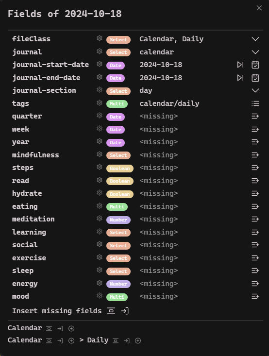

## 16. Bookmarks

Utilizing Bookmarks with the [bookmarks-caller](https://github.com/namikaze-40p/obsidian-bookmarks-caller) plugin to quickly open bookmarked notes.

## 16. Sources

### Omnivore

I am using Omnivore along with fileClass `omnivore` to maintain articles that I maintain/highlight in my [omnivore.app](https://omnivore.app/) account, integration using the official Omnivore Obsidian integration, I have created both frontmatter and backmatter templates for this that can be found here [[Omnivore Frontmatter Template]] and [[Omnivore Template Body]].

### Book Search Plugin

Template for the Book Search Plugin can be found at: [[new book template]]

### PodNotes

### Videos

Add new video template: [[video modal form templater]]

## Changelog

- Version history of the vault template
- Recent updates and modifications

## Resources

- [How to Eliminate Distractions in Obsidian - YouTube](https://youtu.be/u0Sk2CBZUb4?si=UWDRz_tcwfPhLXYV) (Howto)
- [How To Use Obsidian: Dashboards Are OUT. THIS is IN. - YouTube](https://youtu.be/dDDXRSoOZgY?si=3YR36wbOEy3BtxjG) (Feature)
- [My simple note-taking setup | Zettelkasten in Obsidian | Step-by-step guide - YouTube](https://youtu.be/E6ySG7xYgjY?si=u3L3jceOFL-pmCbn) (Example)
- [What Obsidian gurus get wrong about Zettelkasten - YouTube](https://youtu.be/FrvKHFIHaeQ?si=zkbKHgv6z8bGOz2s) (Methodology, Mindset)
- [Am I overcomplicating zettelkasten? \[Reddit reaction\] - YouTube](https://youtu.be/uwzOo2UfuQQ?si=g7HEXuEhUtj7N1Lh) (Methodology, Mindset)
- [Second Brains are a Lie - YouTube](https://youtu.be/-l0jXCQMuwc?si=GEdRmRp0uVVhf-uG) (Philosophy, Mindset)
- [Stop Procrastinating With Note-Taking Apps Like Obsidian, Roam, Logseq - YouTube](https://youtu.be/baKCC2uTbRc?si=pZ8B743zQFLVuNN-) (Philosophy)
- [How to Get Started with Weekly Reflection in Obsidian - YouTube](https://youtu.be/NVu7EWLE34s?si=N4UL-Hl0i0AebYXQ) (Template)
- [What Nobody Tells You About Organizing Folders in Obsidian - YouTube](https://youtu.be/RNH4zpVUm3E?si=vntCAomuUB-cVqCu) (Methodology)

## Credits & Thanks

- [Tony Ramella](https://www.youtube.com/@TonyRamella) (Better understanding Zettlekasten and helped in embracing a loose intepretation of zettlekasten favouring personal style over fixed methodolog and for the Logbook, as well as _Flow_).
- [Paul Dickson](https://www.youtube.com/@PaulDickson7) (Lots of inspo)
- [Prakash Joshi Pax](https://www.youtube.com/@beingpax) (Daily Note setup, Taskido video, lots of inspo)
- [Nick Milo](https://www.youtube.com/@linkingyourthinking) (Efforts and Ideaverse)
- [FromSergio](https://www.youtube.com/@FromSergio) (Tutorials, inspiration)

## Appendices

A. List of all plugins with brief descriptions
B. Complete folder structure map [[index]]
C. All template files: [[templates]]